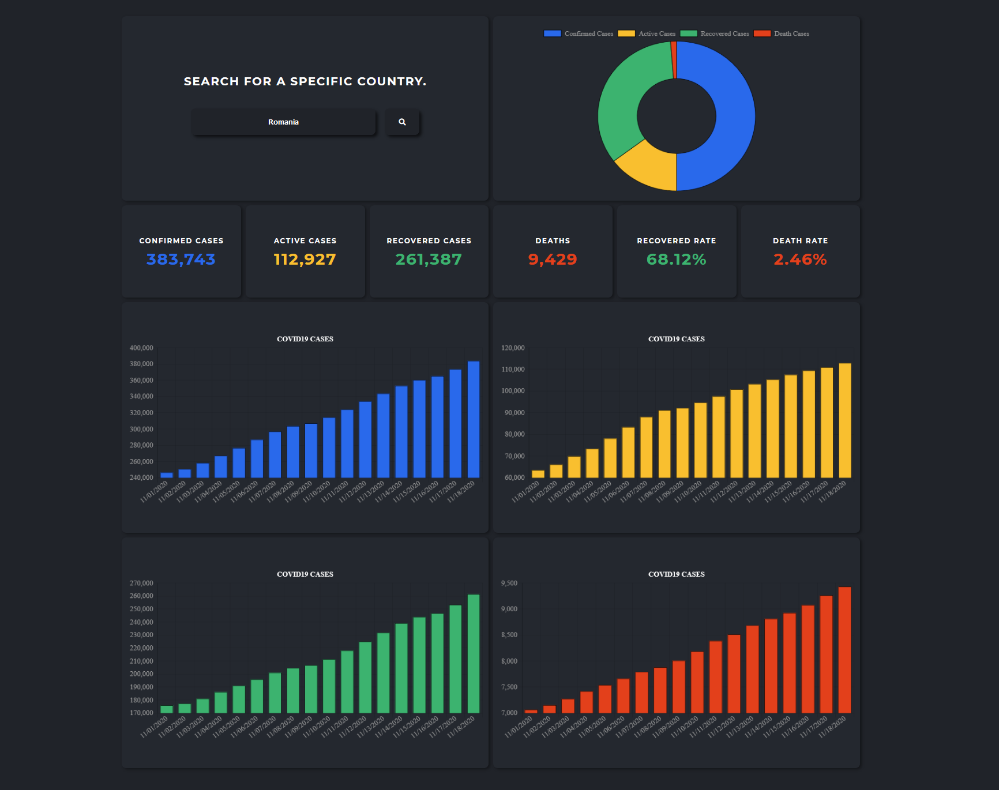

# Features

-   [ ] User can see information about COVID-19 wordwide (infected, recovered, dead, total, active).
-   [ ] User can see information about COVID-19 in a specific country (infected, recovered, dead).
-   [ ] User can enter a search query into an input field.
-   [ ] User can submit the query. If it's empty, an error message will be shown.
-   [ ] When the page loads, user can see global data about COVID19.
-   [ ] User can view 5 charts, one with total number of cases and the others with data from current month.

-   [API](https://documenter.getpostman.com/view/10808728/SzS8rjbc)
-   [CHART.JS](https://www.chartjs.org/)
