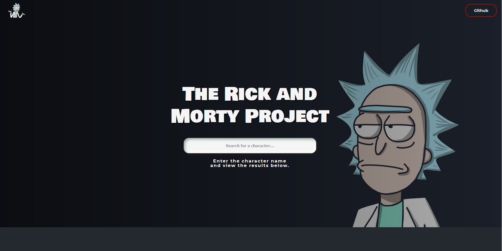

# Features

-   [ ] User can enter a search query into an input field
-   [ ] User can submit the query. This will call an API that will return an array of characters.
-   [ ] Based on the search query, on every key press the characters will be displayed
-   [ ] User can see a list of 50 characters when the page loads.
-   [ ] User can load another list of 50 characters when the 'Load More' button is pressed.
-   [ ] For each character user can see a card with the character image, name and a status.
-   [ ] User can click a card to flip the other side and view more details about the character.

-   [API](https://rickandmortyapi.com/)
