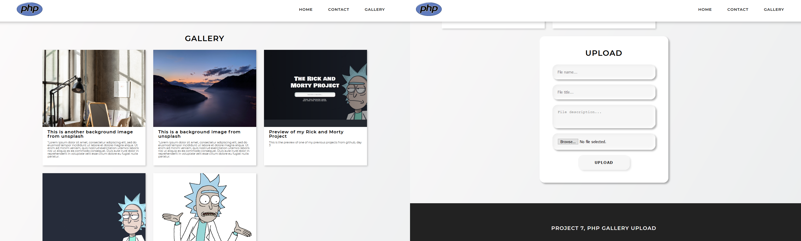

# Features

-   [ ] User can fill data into a form.
-   [ ] If there is an error: empty inputs, wrong image types, image bigger than 5mb, internal errors, database erros, an error message will be displayed into the form.
-   [ ] When the upload button is clicked, a card is created using the data that user filled in.
