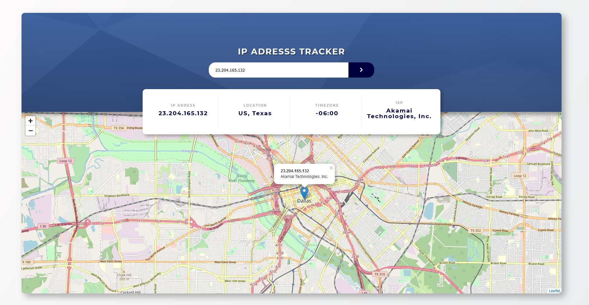

# Features

-   [ ] On page load, the user ip and location will be displayed.
-   [ ] User can enter a search query into an input field.
-   [ ] The search query will be validated using a RegExp expression, IPV4 validation.
-   [ ] User can submit the query. This will call an API that will return an object with coords, ip, isp, location and timezone.
-   [ ] Based on the search query, on search the location will be updated for the current ip.

-   [IP Geolocation API](https://geo.ipify.org/)
-   [MAP](https://leafletjs.com/)
